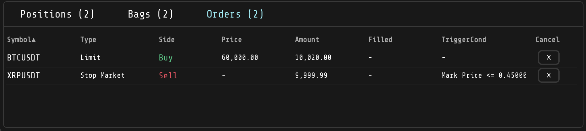

# Trading Terminal

**Demo trading terminal integrated with Binance, enabling seamless placement of orders (functionality disabled in the live version). This application offers a robust set of tools for traders, including real-time competitive news feeds from multiple sources, dynamic and interactive charting capabilities, highly customizable settings for personalized trading strategies, and comprehensive position tracking to monitor all open and pending orders. Designed to enhance the news trading experience, the terminal leverages three dedicated WebSocket connections to ensure timely and relevant updates, automatically isolating coin symbols from news feeds to facilitate informed trading decisions directly from the news stream. While the live demo showcases the core functionalities and user interface, order placement and execution are disabled to maintain security and protect API keys.**

## Live Demo

Experience the demo app online: [Trading Terminal](https://tradingterminal.vercel.app)

## Features

- **Binance Integration:** Seamlessly connect with Binance to manage your trading activities.
- **Real-Time Competitive News Feeds:** Stay informed with the most competitive and up-to-date crypto news from multiple sources.
- **Dynamic Charting:** Visualize coin performance with interactive and real-time charts.
- **Customizable Settings:** Tailor your trading preferences, including coin selection, order types, and size.
- **Comprehensive Position Tracking:** Monitor all your open positions and pending orders in one centralized dashboard.
- **WebSocket Connections:** Receive live updates and news via three dedicated WebSockets.
- **Automated Symbol Isolation:** Automatically isolate coin symbols from news feeds for streamlined trading actions.

## Screenshots

## Screenshots

 

  
  

